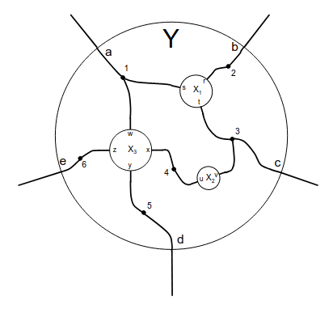

# catgraph

Category-theoretic graph structures in Rust, built on the cospan semantics of [Fong & Spivak, *Hypergraph Categories* (2019)](https://arxiv.org/abs/1806.08304).

Cospans, spans, hypergraph rewriting (DPO), multiway evolution with discrete curvature, Petri nets, wiring diagrams, Frobenius algebras, E_n operads, lattice gauge theory, and morphisms in (symmetric) monoidal categories, with SurrealDB persistence.

Originally based on a fork of [Cobord/Hypergraph](https://github.com/Cobord/Hypergraph), substantially rewritten to use source/target (cospan) semantics, add relation algebra, Temperley-Lieb/Brauer diagrams, E_n operads, morphism systems, and SurrealDB persistence.

823 tests (including 20+ proptest properties), zero clippy pedantic warnings (lib), criterion benchmarks. Rust 2024 edition.

## Component Index

| Module | Component | Purpose |
|--------|-----------|---------|
| `category.rs` | `HasIdentity`, `Composable`, `ComposableMutating` | Core composition traits |
| `cospan.rs` | `Cospan<Lambda>` | Morphisms in Cospan_Λ, pushout composition (union-find) |
| `span.rs` | `Span<Lambda>`, `Rel<Lambda>` | Pullback composition (dual), relation algebra |
| `named_cospan.rs` | `NamedCospan<Lambda, L, R>` | Port-labeled cospans for wiring-style composition |
| `monoidal.rs` | `Monoidal`, `SymmetricMonoidalMorphism`, `GenericMonoidalMorphism` | Tensor product, braiding, generic layered morphisms |
| `frobenius/` | `FrobeniusMorphism`, `MorphismSystem` | String diagram morphisms, DAG-based black-box interpretation |
| `compact_closed.rs` | `cup`, `cap`, `name`, `unname`, `compose_names_direct` / `_via_unname` / `compose_names` | Self-dual compact closed structure (§3.1), Prop 3.3 literal form |
| `cospan_algebra.rs` | `CospanAlgebra`, `PartitionAlgebra`, `NameAlgebra` | Lax monoidal functors Cospan → Set (§2.1) |
| `hypergraph_category.rs` | `HypergraphCategory` | Frobenius generators η, ε, μ, δ with cup/cap (§2.3) |
| `hypergraph_functor.rs` | `HypergraphFunctor`, `RelabelingFunctor`, `CospanToFrobeniusFunctor` | Structure-preserving maps between hypergraph categories (§2.3) |
| `equivalence.rs` | `CospanAlgebraMorphism`, `comp_cospan` | §4 equivalence Hyp_OF ≅ Cospan-Alg (Thm 1.2) |
| `finset.rs` | `Permutation`, `Decomposition` | Epi-mono factorization, order-preserving maps |
| `linear_combination.rs` | `LinearCombination<T, Basis>` | Formal linear combinations over a ring |
| `temperley_lieb.rs` | `BrauerMorphism` | Temperley-Lieb / Brauer algebra diagrams |
| `e1_operad.rs` | `E1` | Little intervals operad |
| `e2_operad.rs` | `E2` | Little disks operad |
| `wiring_diagram.rs` | `WiringDiagram` | Operadic substitution on named cospans |
| `operadic.rs` | `Operadic` | Generic operadic substitution trait |
| `petri_net.rs` | `PetriNet`, `Transition`, `Marking` | Place/transition nets, firing, reachability, cospan bridge |
| `hypergraph/` | `Hypergraph`, `RewriteRule`, `HypergraphEvolution` | DPO rewriting, evolution tracking, cospan bridge |
| `hypergraph/gauge.rs` | `GaugeGroup`, `HypergraphLattice` | Lattice gauge theory, Wilson loops, plaquette action |
| `hypergraph/multiway_cospan.rs` | `MultiwayCospanExt` | Causal invariance via cospan composition |
| `multiway/` | `MultiwayEvolutionGraph`, `BranchialGraph`, `OllivierRicciCurvature` | Multiway BFS, branchial foliation, discrete curvature |
| `catgraph-surreal/` | `CospanStore`, `HyperedgeStore`, `PetriNetStore`, ... | SurrealDB persistence (V1 + V2) |

## Fong-Spivak Feature Map

Features implementing structures from [Fong & Spivak, *Hypergraph Categories*](https://arxiv.org/abs/1806.08304):

| Paper Reference | Module | Summary |
|-----------------|--------|---------|
| Core (§1–2) | `cospan.rs` | `Cospan<Lambda>` — morphisms in Cospan_Λ, composition via pushout (union-find). |
| Core (§1–2) | `span.rs` | `Span<Lambda>` — dual of cospan, composition via pullback. Ex 2.15: Span/Rel. |
| Core | `category.rs` | `HasIdentity`, `Composable`, `ComposableMutating` traits for morphism composition. |
| Core | `monoidal.rs` | `Monoidal`, `SymmetricMonoidalMorphism` traits; tensor product and braiding. |
| Def 2.2 | `cospan_algebra.rs` | `CospanAlgebra` trait — lax monoidal functors Cospan_Λ → C. `PartitionAlgebra` (Ex 2.3, Prop 4.6: initial) and `NameAlgebra` (Prop 4.1). |
| Def 2.5 | `frobenius/` | `FrobeniusMorphism` — string diagram morphisms from the 4 Frobenius generators. `MorphismSystem` DAG for named composition. Ex 2.8: generators as cospans. |
| Def 2.12 | `hypergraph_category.rs` | `HypergraphCategory` trait — Frobenius generators (η, ε, μ, δ) with derived cup/cap. Prop 2.18 (strict case) implicitly satisfied. |
| Def 2.12, Eq 12 | `hypergraph_functor.rs` | `HypergraphFunctor` trait — structure-preserving maps. `RelabelingFunctor` (Thm 3.14: free functor). |
| Prop 3.1–3.4 | `compact_closed.rs` | Self-dual compact closed — cup/cap (Prop 3.1), name bijection (Prop 3.2), `compose_names_direct` realising the literal Prop 3.3 formula `(f̂ ⊗ ĝ) ; comp^Y_{X,Z}`, Prop 3.4 recovery tested by explicit `(id_X ⊗ f̂) ; (cap_X ⊗ id_Y)` construction. Zigzag identities (Eq 13). |
| Lemma 4.3 | `cospan_algebra.rs` | `functor_induced_algebra_map` lifts any `HypergraphFunctor` to a cospan-algebra morphism α: A_H → A_H'. Tests verify naturality, monoidality, and unit preservation for `RelabelingFunctor` and `CospanToFrobeniusFunctor`. |
| Lemma 4.9 | `equivalence.rs` | `functor_from_algebra_morphism` lifts a monoidal natural transformation α: A → B to the induced io hypergraph functor F_α: H_A → H_B by pointwise application. |
| Lemma 3.6, Prop 3.8 | `cospan_algebra.rs`, `hypergraph_functor.rs` | `cospan_to_frobenius` + `CospanToFrobeniusFunctor` — epi-mono decomposition into Frobenius generators. |
| **Thm 1.2** (= 4.13, 4.16) | `equivalence.rs` | `CospanAlgebraMorphism<A>` (Lemma 4.8): cospan-algebra → hypergraph category. `comp_cospan` (Ex 3.5, Eq 32). Identity/Frobenius via Eq 33. Roundtrip: `Hyp_OF ≅ Cospan-Alg`. |

## Additional Features

Features beyond the Fong-Spivak paper:

| Feature | Module | Summary |
|---------|--------|---------|
| Named cospans | `named_cospan.rs` | Port-labeled cospans for wiring-style composition with named boundary nodes. |
| Relation algebra | `span.rs` (`Rel`) | Relations as jointly-injective spans with reflexivity, symmetry, transitivity, set operations. |
| Temperley-Lieb / Brauer | `temperley_lieb.rs` | [Brauer algebra](https://en.wikipedia.org/wiki/Brauer_algebra) diagrams over an arbitrary ground ring via `LinearCombination<BrauerMorphism>`. |
| E_n operads | `e1_operad.rs`, `e2_operad.rs` | [Little cubes operads](https://ncatlab.org/nlab/show/little+cubes+operad) with fallible constructors and epsilon tolerance. |
| Wiring diagrams | `wiring_diagram.rs` | [Wiring diagram operad](https://arxiv.org/abs/1305.0297) (Spivak 2013) built on `NamedCospan`. |
| Petri nets | `petri_net.rs` | Place/transition nets with exact decimal weights, firing, reachability, cospan bridge. |
| DPO rewriting | `hypergraph/` | [Double-pushout](https://en.wikipedia.org/wiki/Graph_rewriting#Double-pushout_approach) rewriting on hypergraphs with evolution tracking. |
| Multiway evolution | `multiway/` | Non-deterministic BFS exploration, branchial foliation, [Ollivier-Ricci curvature](https://en.wikipedia.org/wiki/Ollivier%E2%80%93Ricci_curvature) via W₁ transport. |
| Lattice gauge theory | `hypergraph/gauge.rs` | `GaugeGroup` trait, rewrite-based gauge groups, plaquette/total action, Wilson loops. |
| Finite sets | `finset.rs` | Permutations, order-preserving surjections/injections, epi-mono factorization. |
| Linear combinations | `linear_combination.rs` | Formal linear combinations over a ring with rayon-parallel multiplication. |
| SurrealDB persistence | `catgraph-surreal/` | V1 (embedded arrays) + V2 (RELATE-based graph) persistence with FTS, HNSW, traversal. |

## What catgraph implements

catgraph is an **applied category theory** library for compositional systems — specifically Fong-Spivak-style string diagrams and [cospans](https://en.wikipedia.org/wiki/Span_(category_theory)) with source/target hypergraph semantics. It is not a general category theory library.

### Core: Cospans and Spans

Hyperedges connect **source sets** to **target sets** via typed middle sets:

```
    domain          middle         codomain
   [a, b]  ──left──▶ [x, y, z] ◀──right── [c, d]
```

An edge `[a,b] → [c,d]` means a→c, a→d, b→c, b→d (bipartite complete subgraph). This is distinct from path semantics where `[a,b,c,d]` means a→b→c→d.

| Type | Purpose |
|------|---------|
| `Cospan<Lambda>` | Morphisms in Cospan_Lambda. Composition via pushout (union-find, O(n·α(n))). |
| `NamedCospan<Lambda, L, R>` | Port-labeled cospans for wiring-style composition with named boundary nodes. |
| `Span<Lambda>` | Dual of cospan — composition via pullback. |
| `Rel<Lambda>` | Relations as jointly-injective spans. Full relation algebra (see below). |

`Lambda` types the middle vertices — use `()` for untyped graphs.

### Category Traits

Morphisms in catgraph implement compositional traits:

```rust
pub trait HasIdentity<T>: Sized {
    fn identity(on_this: &T) -> Self;
}

pub trait Composable<T: Eq>: Sized {
    fn compose(&self, other: &Self) -> Result<Self, CatgraphError>;
    fn domain(&self) -> T;
    fn codomain(&self) -> T;
}

pub trait Monoidal {
    fn monoidal(&mut self, other: Self);  // tensor product
}

pub trait SymmetricMonoidalMorphism<T: Eq>: Composable<Vec<T>> + Monoidal {
    fn from_permutation(p: Permutation, types: &[T], types_as_on_domain: bool) -> Result<Self, CatgraphError>;
    fn permute_side(&mut self, p: &Permutation, of_codomain: bool);
}
```

### Relation Algebra (`Rel`)

`Rel<Lambda>` wraps a `Span<Lambda>` with the joint injectivity invariant, providing:

```rust
// Construction
Rel::new(span) -> Result<Self, CatgraphError>  // validates joint injectivity
Rel::new_unchecked(span) -> Self               // trusts caller

// Set operations
rel.union(&other)?, rel.intersection(&other)?, rel.complement()?
rel.subsumes(&other)? -> bool

// Properties (require homogeneous relation: domain == codomain)
rel.is_reflexive(), rel.is_symmetric(), rel.is_antisymmetric(), rel.is_transitive()
rel.is_equivalence_rel(), rel.is_partial_order(), rel.is_irreflexive()
rel.is_homogeneous() -> bool
```

### Frobenius Algebra

Morphisms built from the four distinguished morphisms of a Frobenius object (multiplication, comultiplication, unit, counit) plus braiding and black boxes. The black boxes are labelled and can be interpreted via a user-supplied function.

**MorphismSystem** — a DAG-based framework for named morphism collections with acyclic black-box substitution:

```rust
let mut sys = MorphismSystem::new("circuit".to_string());
sys.add_definition_simple("resistor", resistor_morphism)?;
sys.add_definition_simple("capacitor", capacitor_morphism)?;
sys.add_definition_composite("rc_filter", rc_filter_template)?;  // references resistor + capacitor
let resolved = sys.fill_black_boxes(None)?;  // topological resolution
```

Cycle detection prevents circular definitions. The `Contains` and `InterpretableMorphism` traits enable custom interpretation.

### Brauer / Temperley-Lieb Algebra

[Brauer algebra](https://en.wikipedia.org/wiki/Brauer_algebra) and Temperley-Lieb diagrams over an arbitrary ground ring via `LinearCombination<BrauerMorphism>`.

```rust
let gens = BrauerMorphism::<i64>::temperley_lieb_gens(5);  // e_0 .. e_3
let sym = BrauerMorphism::<i64>::symmetric_alg_gens(5);     // s_0 .. s_3

// TL relations hold:
// e_i * e_i = δ * e_i  (idempotent up to delta)
// s_i * s_i = id        (involution)
// e_i * s_i = e_i       (absorption)
// s_i * s_{i+1} * s_i = s_{i+1} * s_i * s_{i+1}  (braid/Yang-Baxter)
```

### E_n Operads

[Little cubes operads](https://ncatlab.org/nlab/show/little+cubes+operad) with fallible constructors and epsilon tolerance for floating-point boundaries:

| Operad | Objects | Operations |
|--------|---------|------------|
| `E1` | Configurations of intervals in [0,1] | Operadic substitution, coalescence, monoid homomorphism |
| `E2` | Configurations of disks in the unit disk | Operadic substitution, coalescence, `from_e1_config` embedding |

```rust
let e1 = E1::new(vec![(0.0, 0.3), (0.5, 0.8)], true)?;  // overlap_check=true
let e2 = E2::from_e1_config(e1, |i| format!("disk_{i}"));  // embed intervals as disks on x-axis
```

### Wiring Diagrams

An operad built on `NamedCospan` implementing the [wiring diagram operad](https://arxiv.org/abs/1305.0297) for compositional system modeling.



### Petri Nets

Place/transition Petri nets built on cospan semantics. Places are Lambda-typed, transitions have `rust_decimal::Decimal` arc weights (exact arithmetic), firing is pure.

```rust
use catgraph::petri_net::{PetriNet, Transition, Marking};
use rust_decimal::Decimal;

// 2H2 + O2 -> 2H2O
let net: PetriNet<&str> = PetriNet::new(
    vec!["H2", "O2", "H2O"],
    vec![Transition::new(
        vec![(0, Decimal::from(2)), (1, Decimal::from(1))],
        vec![(2, Decimal::from(2))],
    )],
);
let m0 = Marking::from_vec(vec![(0, Decimal::from(4)), (1, Decimal::from(2))]);
let m1 = net.fire(0, &m0).unwrap();     // 2H2 consumed, 2H2O produced
let reachable = net.reachable(&m0, 10);  // BFS over marking graph
```

Supports parallel composition (disjoint union), sequential composition (merge boundary places by Lambda match), and bidirectional cospan bridge (`from_cospan`, `transition_as_cospan`).

### Hypergraph Rewriting

[Double-Pushout (DPO)](https://en.wikipedia.org/wiki/Graph_rewriting#Double-pushout_approach) rewriting on hypergraphs with evolution tracking, causal invariance analysis, and lattice gauge theory.

```rust
use catgraph::hypergraph::{Hypergraph, Hyperedge, RewriteRule, HypergraphEvolution};

// Wolfram-style A -> BB rewriting
let rule = RewriteRule::wolfram_a_to_bb();
let mut graph = Hypergraph::from_edges(vec![Hyperedge::new(vec![0, 1])]);
let matches = rule.find_matches(&graph);
let new_graph = rule.apply(&graph, &matches[0])?;

// Evolution tracking with causal invariance
let mut evo = HypergraphEvolution::new(graph.clone());
evo.step_deterministic(&rule)?;
let chain = evo.to_cospan_chain();  // bridge to catgraph Cospan<u32>
```

**Gauge theory**: `GaugeGroup` trait, `HypergraphRewriteGroup` for rewrite-based gauge groups, `HypergraphLattice` for lattice gauge configurations with `plaquette_action` and `total_action`.

### Multiway Evolution

Generic multiway (non-deterministic) computation infrastructure for branching systems where multiple execution paths exist simultaneously.

```rust
use catgraph::multiway::{
    MultiwayEvolutionGraph, run_multiway_bfs,
    extract_branchial_foliation, OllivierRicciCurvature,
};

// Build multiway graph via BFS exploration
let graph = run_multiway_bfs(initial_state, |s| successor_fn(s), max_steps);

// Extract branchial (time-slice) foliation
let foliation = extract_branchial_foliation(&graph);

// Compute Ollivier-Ricci curvature on branchial slices
let curvature = OllivierRicciCurvature::compute_foliation(&foliation);
```

- **`MultiwayEvolutionGraph<S,T>`**: Tracks branching state evolution with branch IDs, merge detection, and cycle finding
- **`BranchialGraph`**: Time-slice foliation extracting the tensor product structure at each step
- **`OllivierRicciCurvature`**: Edge, vertex, and scalar curvature via Wasserstein-1 optimal transport
- **`wasserstein_1`**: Transportation simplex W₁ solver for discrete probability distributions

### Finite Sets

`finset.rs` provides morphisms between finite sets:
- `Permutation` — via the `permutations` crate
- `OrderPresSurj` / `OrderPresInj` — order-preserving surjections/injections
- `Decomposition` — epi-mono factorization (every morphism = surjection ∘ injection)

### Linear Combinations

`LinearCombination<T, Basis>` — formal linear combinations over a ring. Supports ring axioms (add, mul, scalar mul) with rayon-parallel multiplication above 32 terms. Used as the coefficient structure for Brauer algebra diagrams.

## SurrealDB Persistence

The `catgraph-surreal` workspace member provides typed persistence for catgraph structures in [SurrealDB](https://surrealdb.com/) with two coexisting layers:

**V1 (embedded arrays)** — O(1) reconstruction via `CospanStore`, `NamedCospanStore`, `SpanStore`. Each n-ary hyperedge is a single record with embedded arrays encoding the structural maps.

**V2 (RELATE-based graph)** — Graph-native persistence with `NodeStore`, `EdgeStore`, `HyperedgeStore`, `PetriNetStore`, `WiringDiagramStore`, `HypergraphEvolutionStore`, `FingerprintEngine`, and `QueryHelper`. Supports:
- Hub-node reification for n-ary hyperedges with decimal participation weights
- Full-text search on node names (BM25 with edgengram analyzer)
- HNSW vector similarity search on structural fingerprints (configurable dimension)
- Graph traversal: BFS reachable, shortest path, collect all reachable
- Native Petri net persistence with marking snapshots
- Hypergraph evolution persistence (cospan chains + rewrite rule spans)
- Record references with `ON DELETE UNSET` and computed provenance fields

```rust
use catgraph_surreal::{init_schema, init_schema_v2};
use catgraph_surreal::hyperedge_store::HyperedgeStore;
use catgraph_surreal::petri_net_store::PetriNetStore;
use catgraph_surreal::fingerprint::FingerprintEngine;

let db = Surreal::new::<Mem>(()).await?;
db.use_ns("test").use_db("test").await?;
init_schema(&db).await?;
init_schema_v2(&db).await?;

// Hyperedge decomposition
let store = HyperedgeStore::new(&db);
let hub_id = store.decompose_cospan(&cospan, "reaction", props, |c| c.to_string()).await?;
let reconstructed: Cospan<char> = store.reconstruct_cospan(&hub_id).await?;

// Petri net persistence
let pn_store = PetriNetStore::new(&db);
let net_id = pn_store.save(&net, "combustion").await?;
let mark_id = pn_store.save_marking(&net_id, &marking, "initial").await?;

// Structural similarity search
let engine = FingerprintEngine::new(&db, 32);
engine.init_index().await?;
let fp = engine.index_node(&node_id).await?;
let similar = engine.search_similar(&fp, 10, 50).await?;
```

175 tests cover V1 roundtrips, V2 CRUD/traversal, provenance, Petri net persistence, wiring diagrams, hypergraph evolution, graph recursion, fingerprint search, FTS, named cospan port name roundtrip, and domain-specific use cases.

## Examples

Standalone examples in `examples/` demonstrate each module's pub API:

```bash
cargo run --example cospan              # Cospan construction, composition, monoidal
cargo run --example span                # Span, Rel algebra
cargo run --example named_cospan        # Port-labeled cospans
cargo run --example monoidal            # Tensor product, braiding
cargo run --example finset              # Permutations, epi-mono factorization
cargo run --example frobenius           # String diagrams, MorphismSystem DAG
cargo run --example hypergraph_category # Frobenius generators η, ε, μ, δ (§2.3)
cargo run --example compact_closed      # Cup/cap, zigzag, name bijection (§3.1)
cargo run --example cospan_algebra      # CospanAlgebra, PartitionAlgebra, NameAlgebra (§2.1)
cargo run --example hypergraph_functor  # RelabelingFunctor, CospanToFrobeniusFunctor (§2.3)
cargo run --example equivalence         # §4 equivalence Hyp_OF ≅ Cospan-Alg (Thm 1.2)
cargo run --example petri_net           # Petri net firing, reachability, composition
cargo run --example e1_operad           # Little intervals operad
cargo run --example e2_operad           # Little disks operad
cargo run --example wiring_diagram      # Wiring diagram operad
cargo run --example temperley_lieb      # TL/Brauer generators
cargo run --example linear_combination  # Linear combinations over morphisms
cargo run --example stokes              # TemporalComplex + ConservationResult
cargo run --example hypergraph          # DPO rewriting, evolution, cospan bridge
cargo run --example multiway            # Multiway BFS, branchial foliation, curvature
cargo run --example gauge               # Lattice gauge theory, Wilson loops
```

## Testing

```bash
cargo test --workspace        # 1080+ tests (900+ catgraph + 175 bridge), 1 ignored
cargo test                    # catgraph-only (900+: 492 unit + 405 integration + 11 doc)
cargo test -p catgraph-surreal # bridge crate (175: 25 unit + 150 integration)
cargo clippy                  # zero warnings
```

Integration test suites:

| File | Tests | What it covers |
|------|-------|---------------|
| `catgraph_bridge` | 9 | Hypergraph span/cospan bridge roundtrips |
| `composition_laws` | 17 | Associativity, identity, empty/large boundaries |
| `cross_type_interactions` | 6 | NamedCospan ports, to_graph, ring axioms |
| `finset_coverage` | 20 | FinSet morphisms, decomposition, edge cases |
| `frobenius_laws` | 8 | Braiding, spider fusion, unit/counit, monoidal |
| `hypergraph_rewriting` | 20 | DPO rewriting, match finding, rule application |
| `linear_combination_coverage` | 11 | Ring axioms, scalar mul, parallel mul |
| `monoidal_structure` | 6 | Tensor associativity/unit, braiding, permute_side |
| `morphism_system` | 8 | DAG resolution, cycle detection, multi-level fill |
| `multiway_evolution` | 17 | MultiwayEvolutionGraph, branchial, curvature, pipeline |
| `mutation_workflows` | 20 | Cospan/Span add/delete/connect/map then compose, identity flags |
| `operad_boundary` | 28 | E1/E2 epsilon boundaries, embedding, substitution, coalescence, min_closeness |
| `petri_net` | 8 | Chemical reactions, reachability, composition, cospan roundtrip |
| `property_laws` | 8 | Proptest: identity, associativity, dagger involution, monoidal |
| `pushout_correctness` | 9 | Union-find pushout, wire merging, determinism |
| `relation_algebra` | 21 | Rel API, equivalence relations, partial orders, set operations |
| `temperley_lieb` | 10 | TL/symmetric generators, braid relation, monoidal |
| `wiring_diagram` | 14 | Operadic substitution, boundary mutations, map, sequential composition |
| `stokes_laws` | 8 | Conservation verification, cospan chain, exterior derivative |
| `gauge_theory` | 19 | Structure constants, Wilson loops, DPO on lattice, plaquette action |
| `compact_closed` | 44 | Cup/cap, zigzag identities, tensor ordering, name bijection, compose_names direct/via-unname equivalence, Prop 3.4 literal form |
| `cospan_algebra` | 25 | PartitionAlgebra, NameAlgebra, functoriality, lax monoidal, Prop 4.6 initiality proptest, Lemma 4.3 A_F functor induction |
| `equivalence` | 22 | H_Part axioms, comp_cospan, roundtrip Hyp_OF ≅ Cospan-Alg (Thm 1.2), Lemma 4.9 F_α io functor |
| `rayon_parallel` | 4 | Above-threshold correctness for 4 rayon-enabled modules |

## Parallelization

The library uses rayon for parallel computation with adaptive thresholds:

| Module | Parallelized Operation | Threshold |
|--------|------------------------|-----------|
| `linear_combination.rs` | `Mul` impl, `linear_combine` | 32 terms |
| `temperley_lieb.rs` | `non_crossing` checks | 8 elements |
| `named_cospan.rs` | `find_nodes_by_name_predicate` | 256 elements |
| `frobenius/operations.rs` | `hflip` block mutations | 64 blocks |

All parallelism is rayon-based (CPU-bound). For tokio integration, use **tokio-rayon** (not `spawn_blocking`).

## Benchmarks

Criterion benchmarks in `benches/` cover core operations and rayon threshold validation:

```bash
cargo bench                              # run all benchmarks
cargo bench --bench pushout              # cospan pushout composition (sizes 4–1024)
cargo bench --bench pullback             # span pullback composition (sizes 4–1024)
cargo bench --bench rayon_thresholds     # validate rayon parallel thresholds
```

HTML reports are generated in `target/criterion/`. For profiling:

```bash
cargo install flamegraph
cargo flamegraph --bench pushout -- --bench "pushout_compose/1024"
```

## Dependencies

### catgraph (core)
- `petgraph` — graph data structures (StableDiGraph, toposort, connectivity)
- `itertools` — iterator utilities
- `either` — Left/Right sum type for bipartite node types
- `num` — numeric traits (One, Zero)
- `permutations` — permutation type for symmetric monoidal
- `union-find` — QuickUnionUf for pushout composition
- `rayon` — data parallelism with adaptive thresholds
- `log` — warning messages
- `rand` — random number generation (multiway exploration)
- `rust_decimal` — exact decimal arithmetic for Petri net weights
- `thiserror` — structured error types
- Dev: `env_logger`, `proptest`, `criterion`

### catgraph-surreal (bridge)
- `surrealdb` 3.0.5 (kv-mem) — embedded SurrealDB
- `surrealdb-types` 3.0.5 — SurrealValue derive macro
- `serde` + `serde_json` — JSON serialization for Lambda labels
- `rust_decimal` — exact decimal arithmetic for weights
- `petgraph` — structural fingerprint computation
- `tokio` — async runtime
- `thiserror` — error type derivation

## Usage

```toml
[dependencies]
catgraph = { git = "https://github.com/tsondru/catgraph" }
catgraph-surreal = { git = "https://github.com/tsondru/catgraph" }  # optional
```

```rust
use catgraph::cospan::Cospan;
use catgraph::span::{Span, Rel};
use catgraph::named_cospan::NamedCospan;
use catgraph::frobenius::MorphismSystem;
use catgraph::temperley_lieb::BrauerMorphism;
use catgraph::e1_operad::E1;
use catgraph::e2_operad::E2;
use catgraph::petri_net::{PetriNet, Transition, Marking};
use catgraph::hypergraph::{Hypergraph, Hyperedge, RewriteRule, HypergraphEvolution};
use catgraph::multiway::{MultiwayEvolutionGraph, run_multiway_bfs, OllivierRicciCurvature};
use catgraph::errors::CatgraphError;
use catgraph::category::{Composable, HasIdentity};
use catgraph::monoidal::{Monoidal, SymmetricMonoidalMorphism};
```

## Contributors

- [tsondru](https://github.com/tsondru)
- [Claude](https://claude.ai) (Anthropic)

## Acknowledgments

This project originated as a fork of [Cobord/Hypergraph](https://github.com/Cobord/Hypergraph).

## References

- [Fong & Spivak, *Hypergraph Categories* (2019)](https://arxiv.org/abs/1806.08304) — primary theoretical foundation
- [Spivak, *The Operad of Wiring Diagrams* (2013)](https://arxiv.org/abs/1305.0297)
- [Span and Cospan (Wikipedia)](https://en.wikipedia.org/wiki/Span_(category_theory))
- [Double-Pushout Graph Rewriting (Wikipedia)](https://en.wikipedia.org/wiki/Graph_rewriting#Double-pushout_approach)
- [Ollivier-Ricci Curvature (Wikipedia)](https://en.wikipedia.org/wiki/Ollivier%E2%80%93Ricci_curvature)
- [E_n Operad (nLab)](https://ncatlab.org/nlab/show/little+cubes+operad)
- [Brauer Algebra (Wikipedia)](https://en.wikipedia.org/wiki/Brauer_algebra)

## License

[MIT](LICENSE)
